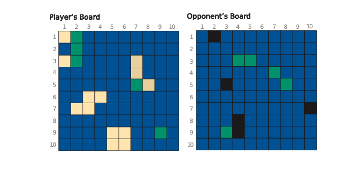

# BattleShip



**Game Description**

The coordinates that make up the ships are the color of sand. When the player’s opponent guesses correctly and hits a ship, the coordinate the opponent hits will turn red. Otherwise, it will turn black. If all the coordinates that make up a ship are hit, the ship is sunk, and when all of a player’s ships are sunk, the opponent has won the game.

**TODO: Add demo video**

## Installation

If [available in Hex](https://hex.pm/docs/publish), the package can be installed
by adding `battle_ship` to your list of dependencies in `mix.exs`:

```elixir
def deps do
  [
    {:battle_ship, "~> 0.1.0"}
  ]
end
```

Documentation can be generated with [ExDoc](https://github.com/elixir-lang/ex_doc)
and published on [HexDocs](https://hexdocs.pm). Once published, the docs can
be found at <https://hexdocs.pm/battle_ship>.
